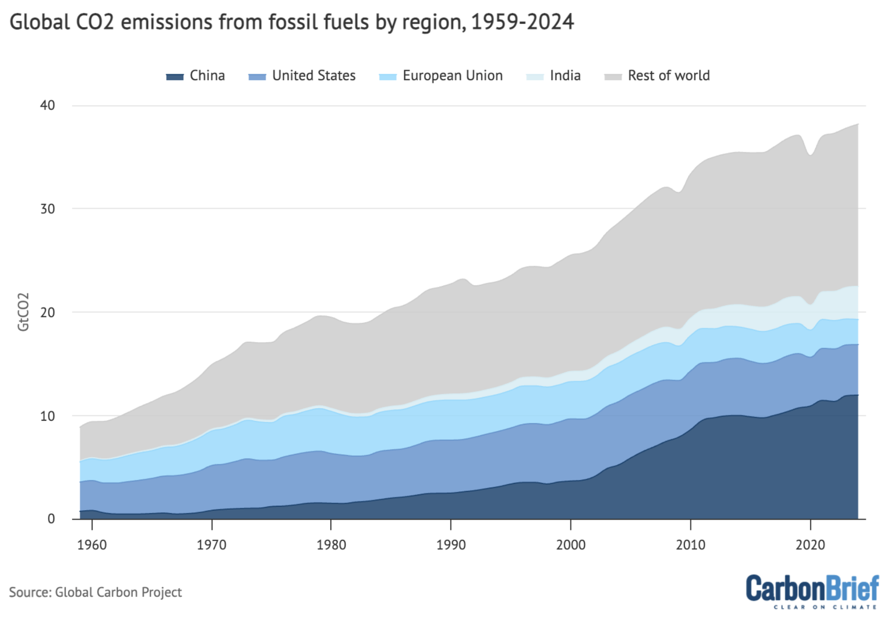

## 1. Introduction

This project redesigns a stacked area chart of global fossil CO₂ emissions published by Carbon Brief using data from the Global Carbon Project. The original visualization presents annual fossil CO₂ emissions from China, India, the United States, the European Union, and the Rest of the World. In this redesign, we focus on the five highest-emitting countries instead. This allows for a more direct comparison between major emitters and avoids using broad aggregated categories that can hide differences between individual countries.

Climate change is one of the most important global challenges today, and visualizations like this are often used in news articles to shape public understanding of the issue. While the original chart effectively communicates that global fossil CO₂ emissions have continued to increase, its stacked area design makes it difficult to compare the emission trends of individual regions. In addition, it focuses only on total emissions without considering population size, which can lead readers to overlook differences in emissions on a per-person basis.

To address these issues, our redesign uses a compact sparkline summary table that combines historical trends with total emissions, per-capita emissions, percentage share of global emissions and recent changes for each country. This allows readers to compare the five countries more directly while providing additional context beyond absolute emissions.

The original article includes a preliminary estimate for 2024, but the underlying dataset contains confirmed observations only up to 2023. To ensure that our analysis is based on verified data, our redesigned visualizations use the period 1959–2023 for total emissions and 1960–2023 for analyses that require population data.

## 2. Original Visualization

{width=80%}

**Article:** [Carbon Brief (2024)](https://www.carbonbrief.org/analysis-global-co2-emissions-will-reach-new-high-in-2024-despite-slower-growth/)

**Data source:** [Global Carbon Project](https://globalcarbonbudget.org/gcb-2024/)

### 2.1 Strengths

- The visualization presents a long historical record (1959–2024), allowing readers to observe long-term structural changes such as China's rapid growth after 2000, the decline in emissions from the United States and European Union, and the temporary COVID-19 dip in 2020.
- A zero baseline is appropriate for showing absolute emissions in a stacked area chart, allowing the overall magnitude of global emissions to be interpreted accurately.
- The stacked area effectively communicates the overall increase in global fossil CO₂ emissions over time.

### 2.2 Weaknesses

- Except for the bottom layer, country values must be estimated by mentally comparing two moving boundaries, making comparisons between countries difficult.
- Similar blue gradient colours imply an ordered relationship even though the regions are categorical, making the countries harder to distinguish.
- The legend is separated from the data and its ordering does not match the visual stacking, requiring unnecessary eye movement when identifying countries.
- The European Union and Rest of World are aggregated categories, so they cannot be compared directly with individual countries on the same basis.
- The visualization focuses only on total emissions and provides no per-capita context, making it difficult to compare emissions relative to population size.

### 2.3 Proposed Improvements

The redesign replaces the stacked area chart with a compact sparkline summary table, allowing each country’s historical trend to be viewed independently without comparing stacked layers. It focuses on the five highest-emitting countries in 2023 and removes broad aggregated categories such as the European Union and Rest of World. The table also reports total emissions, per-capita emissions, percentage share of global emissions and changes from 2019 to 2023 in a single view. Distinct colourblind-friendly colours make the countries easier to distinguish.

## 3. Design Brief

::: {.callout-note appearance="simple" icon=false}
## Design Brief

This redesign targets **general readers of climate news** who want to understand and compare how the largest emitting countries contribute to global CO₂ emissions. The goal is to show both **total** and **per-capita emissions**, so readers can compare national contributions from more than one perspective. The redesign focuses on the five highest-emitting countries in 2023, which together account for about 60% of global fossil CO₂ emissions while keeping the comparison manageable.

**Main revisions:**

- **Focus on the five highest-emitting countries in 2023** to support direct country-to-country comparisons
- **Sparkline summary table** replacing the stacked area chart so each country's historical trend can be viewed independently
- **Integrated summary metrics** showing total emissions, per-capita emissions, percentage share, and changes from 2019 to 2023 alongside each sparkline
- **Distinct Okabe–Ito colours** replacing the original gradient blues because the countries are nominal categories
- **Direct country labels** in the first column, removing the need for a separate legend

:::

## 4. Data Preparation

### 4.1 Fossil Carbon Emissions Data

| | |
|---|---|
| **Dataset** | National Fossil Carbon Emissions 2024 v1.0 |
| **Source** | Global Carbon Project (GCB 2024) |
| **Dataset URL** | <https://globalcarbonbudget.org/gcb-2024/> |
| **News article** | <https://www.carbonbrief.org/analysis-global-co2-emissions-will-reach-new-high-in-2024-despite-slower-growth/> |
| **File** | `National_Fossil_Carbon_Emissions_2024v1.0-1.xlsx` |

The original visualization appeared in a Carbon Brief article published in November 2024,
which projected that 2024 global fossil CO₂ emissions would reach a record 37.4 GtCO₂.
The underlying dataset contains **confirmed figures from 1850 to 2023** only and the 2024
value shown in the article was a preliminary estimate, not part of the dataset. Our
redesign therefore covers the confirmed range of 1959–2023.

Values are reported in **million tonnes of carbon per year (MtC/yr)**. We convert to
**billion tonnes of CO₂ per year (GtCO₂/yr)** using the factor 1 MtC = 3.664 MtCO₂
(as documented in the dataset).

We use the **"Territorial Emissions"** sheet, which records emissions produced within each
country's borders (excluding land-use change and consumption-based transfers).

The raw Excel file is included in `data/raw/` and the cleaned CSV outputs are in `data/cleaned/`.

### 4.2 Population Data

| | |
|---|---|
| **Dataset** | World Development Indicators — Total Population |
| **Source** | World Bank, based on United Nations World Population Prospects |
| **URL** | <https://data.worldbank.org/indicator/SP.POP.TOTL> |
| **File** | `API_SP.POP.TOTL_DS2_en_excel_v2_417154.xls` |

This dataset provides annual total population by country from 1960 to 2023. It is used
to compute **per-capita CO₂ emissions** (tonnes CO₂ per person) for each selected country,
addressing the critique that the original chart shows only absolute totals. Per-capita
values provide an additional perspective because countries differ greatly in population size.

### 4.3 GDP Data

| | |
|---|---|
| **Dataset** | World Development Indicators — GDP (current US$) |
| **Source** | World Bank |
| **URL** | <https://data.worldbank.org/indicator/NY.GDP.MKTP.CD> |
| **File** | `API_NY.GDP.MKTP.CD_DS2_en_excel_v2_33067.xls` |

This dataset provides annual GDP measured in current US dollars. We use the
2019 to 2023 values for the five selected countries to calculate the percentage
change in GDP over the period. Adding GDP provides economic context alongside
the change in fossil CO₂ emissions shown in the sparkline table.

Because the indicator is measured in current US dollars, the result is described
as **GDP change** rather than real GDP growth.

### 4.4 Data Import and Cleaning Pipeline

#### 4.4.1 Load Packages

```{r}
#| label: load-packages
library(tidyverse)
library(readxl)
library(scales)
```

#### 4.4.2 Import Raw Data

The emissions Excel file has several header rows with metadata (citation info, unit
descriptions, notes on methodology) before the actual data begins. We skip the first
11 rows to land directly on the data, where each row is a year and each column is a
country.

```{r}
#| label: import-raw
emissions_raw <- read_excel(
  "data/raw/National_Fossil_Carbon_Emissions_2024v1.0-1.xlsx",
  sheet = "Territorial Emissions",
  skip = 11
)

# First column is the year (unnamed in Excel)
names(emissions_raw)[1] <- "year"

cat(
  "Raw dataset:",
  nrow(emissions_raw),
  "rows x",
  ncol(emissions_raw),
  "columns\n"
)
cat(
  "Year range:",
  min(emissions_raw$year, na.rm = TRUE),
  "-",
  max(emissions_raw$year, na.rm = TRUE),
  "\n"
)
```

#### 4.4.3 Identify the Five Highest-Emitting Countries

The dataset contains individual country columns followed by several overlapping aggregate
groups such as OECD, EU27 and geographic regions. To avoid mixing countries with aggregates,
we treat all columns before `KP Annex B` as country-level records. We then rank these
countries using their confirmed 2023 emissions and select the five highest emitters.

```{r}
#| label: identify-top-five
# Keep only rows with valid numeric years
emissions_clean <- emissions_raw |>
  filter(!is.na(year)) |>
  mutate(year = as.numeric(year)) |>
  filter(!is.na(year))

# Individual country columns appear before the aggregate group columns
aggregate_start <- match("KP Annex B", names(emissions_clean))
country_cols <- names(emissions_clean)[2:(aggregate_start - 1)]

top5_countries <- emissions_clean |>
  filter(year == 2023) |>
  select(all_of(country_cols)) |>
  pivot_longer(
    cols = everything(),
    names_to = "dataset_name",
    values_to = "emissions_mtc"
  ) |>
  filter(!is.na(emissions_mtc)) |>
  slice_max(
    order_by = emissions_mtc,
    n = 5,
    with_ties = FALSE
  ) |>
  mutate(
    country = recode(
      dataset_name,
      "USA" = "United States"
    )
  )

selected_country_cols <- top5_countries$dataset_name

top5_countries |>
  transmute(
    Country = country,
    `2023 emissions (MtC)` = round(emissions_mtc, 1)
  ) |>
  knitr::kable(
    caption = "Five highest-emitting countries selected from the 2023 data"
  )
```

#### 4.4.4 Clean and Convert Emissions Data

The raw values are reported in MtC/yr (million tonnes of carbon per year). We convert
them to GtCO₂/yr (billion tonnes of CO₂ per year) using the factor documented in the
dataset: multiply by 3.664 to convert carbon to CO₂, then divide by 1000 to convert
million tonnes to billion tonnes.

```{r}
#| label: clean-convert
MTC_TO_GTCO2 <- 3.664 / 1000

world_totals <- emissions_clean |>
  transmute(
    year,
    world_gtco2 = as.numeric(.data[["World"]]) * MTC_TO_GTCO2
  ) |>
  filter(year >= 1959, year <= 2023)

emissions_long <- emissions_clean |>
  select(year, all_of(selected_country_cols)) |>
  pivot_longer(
    cols = -year,
    names_to = "dataset_name",
    values_to = "emissions_mtc"
  ) |>
  mutate(
    country = recode(
      dataset_name,
      "USA" = "United States"
    ),
    emissions_gtco2 = as.numeric(emissions_mtc) * MTC_TO_GTCO2
  ) |>
  select(year, country, emissions_gtco2) |>
  filter(year >= 1959, year <= 2023) |>
  left_join(world_totals, by = "year") |>
  mutate(
    pct_share = emissions_gtco2 / world_gtco2 * 100,
    country = factor(
      country,
      levels = top5_countries$country
    )
  )

emissions_wide <- emissions_long |>
  select(year, country, emissions_gtco2) |>
  pivot_wider(
    names_from = country,
    values_from = emissions_gtco2
  )

cat("Selected countries:", paste(top5_countries$country, collapse = ", "), "\n")
cat("Cleaned dataset:", nrow(emissions_long), "country-year rows\n")
```

#### 4.4.5 Save Cleaned Emissions Data

```{r}
#| label: save-cleaned
write_csv(emissions_wide, "data/cleaned/emissions_wide.csv")
write_csv(emissions_long, "data/cleaned/emissions_by_country.csv")

cat("Saved: data/cleaned/emissions_wide.csv\n")
cat("Saved: data/cleaned/emissions_by_country.csv\n")
```

#### 4.4.6 Import Population Data

The original visualization only shows absolute emissions. However, countries have very
different population sizes, so total emissions alone do not provide the full picture.
We therefore use World Bank population data to calculate emissions per person.

```{r}
#| label: import-population
pop_raw <- read_excel(
  "data/raw/API_SP.POP.TOTL_DS2_en_excel_v2_417154.xls",
  sheet = "Data",
  skip = 3
)

cat("Population dataset:", nrow(pop_raw), "rows x", ncol(pop_raw), "columns\n")
```

#### 4.4.7 Clean and Merge Population Data

The country names in the two datasets are not completely identical. For example, the
emissions dataset uses `USA` and `Russia`, while the World Bank uses `United States` and
`Russian Federation`. A lookup table is used to match these names consistently.

```{r}
#| label: clean-population
country_lookup <- tibble(
  dataset_name = c("China", "USA", "India", "Russia", "Japan"),
  country = c("China", "United States", "India", "Russia", "Japan"),
  wb_name = c("China", "United States", "India", "Russian Federation", "Japan")
) |>
  filter(dataset_name %in% selected_country_cols)

if (nrow(country_lookup) != length(selected_country_cols)) {
  stop("The population lookup does not cover every selected country.")
}

pop_long <- pop_raw |>
  filter(`Country Name` %in% country_lookup$wb_name) |>
  select(`Country Name`, matches("^\\d{4}$")) |>
  pivot_longer(
    cols = -`Country Name`,
    names_to = "year",
    values_to = "population"
  ) |>
  mutate(year = as.numeric(year)) |>
  filter(year >= 1960, year <= 2023) |>
  left_join(
    country_lookup,
    by = c("Country Name" = "wb_name")
  ) |>
  select(year, country, population)

cat("Population data:", nrow(pop_long), "country-year rows\n")
cat("Year range:", min(pop_long$year), "-", max(pop_long$year), "\n")
```

#### 4.4.8 Compute Per-Capita Emissions

We join emissions and population by country and year. GtCO₂ is converted to tonnes before
dividing by population, producing tonnes of CO₂ per person. Since World Bank population
data starts in 1960, the combined dataset covers 1960–2023.

```{r}
#| label: per-capita
emissions_percapita <- emissions_long |>
  inner_join(pop_long, by = c("country", "year")) |>
  mutate(
    emissions_per_capita = (emissions_gtco2 * 1e9) / population
  )

cat("Merged dataset:", nrow(emissions_percapita), "rows\n")
cat(
  "Year range:",
  min(emissions_percapita$year),
  "-",
  max(emissions_percapita$year),
  "\n\n"
)

emissions_percapita |>
  filter(year == 2023) |>
  arrange(desc(emissions_per_capita)) |>
  mutate(
    emissions_per_capita = round(emissions_per_capita, 2),
    population_m = round(population / 1e6, 0)
  ) |>
  select(country, emissions_per_capita, population_m) |>
  knitr::kable(
    col.names = c("Country", "tCO2/person (2023)", "Population (millions)"),
    caption = "Per-capita emissions for the selected countries (2023)"
  )
```

```{r}
#| label: save-percapita
write_csv(emissions_percapita, "data/cleaned/emissions_percapita.csv")
cat("Saved: data/cleaned/emissions_percapita.csv\n")
```

#### 4.4.9 Import GDP Data

The World Bank workbook contains several metadata rows before the main data
table. We import the `Data` sheet and skip the first three rows so that the
country and annual GDP fields are read with the correct column names.
```{r}
#| label: import-gdp

gdp_raw <- read_excel(
  "data/raw/API_NY.GDP.MKTP.CD_DS2_en_excel_v2_33067.xls",
  sheet = "Data",
  skip = 3
)
cat("GDP dataset imported:", nrow(gdp_raw), "countries,", ncol(gdp_raw), "columns\n")
```


#### 4.4.10 Clean GDP Data

We keep the GDP current US$ indicator and the five selected countries. The
annual year columns are reshaped into country-year rows, country names are
standardised using the existing lookup table, and the data is restricted from
2019 to 2023.
```{r}
#| label: clean-gdp

CHANGE_START_YEAR <- 2019L
CHANGE_END_YEAR <- 2023L

gdp_clean <- gdp_raw |>
  # Keep the required indicator and countries
  filter(
    `Indicator Code` == "NY.GDP.MKTP.CD",
    `Country Name` %in% country_lookup$wb_name
  ) |>
  select(`Country Name`, matches("^\\d{4}$")) |>

  # Reshape annual columns into tidy country-year rows
  pivot_longer(
    cols = -`Country Name`,
    names_to = "year",
    values_to = "gdp_usd",
    names_transform = list(year = parse_integer),
    values_transform = list(gdp_usd = as.numeric)
  ) |>
  filter(between(year, CHANGE_START_YEAR, CHANGE_END_YEAR)) |>

  # Standardise country names
  left_join(
    country_lookup |>
      select(country, wb_name),
    by = c("Country Name" = "wb_name")
  ) |>
  transmute(country, year, gdp_usd) |>
  arrange(country, year)

cat(
  "Clean GDP data:", n_distinct(gdp_clean$country), "countries,",
  min(gdp_clean$year), "-", max(gdp_clean$year), "\n"
)

```

#### 4.4.11 Validate GDP Data

We validate the cleaned data by checking that every selected country has all
five annual observations from 2019 to 2023 and that there are no missing GDP
values. This prevents incomplete data from being used in the percentage change
calculation.
```{r}
expected_year_count <- CHANGE_END_YEAR - CHANGE_START_YEAR + 1L

gdp_validation <- gdp_clean |>
  group_by(country) |>
  summarise(
    year_count = n_distinct(year),
    missing_values = sum(is.na(gdp_usd)),
    .groups = "drop"
  )

if (
  nrow(gdp_validation) != nrow(country_lookup) ||
    any(gdp_validation$year_count != expected_year_count) ||
    any(gdp_validation$missing_values > 0)
) {
  stop(
    "GDP validation failed: check the selected countries, years or missing values."
  )
}

gdp_validation
```

#### 4.4.12 Calculate GDP Percentage Change from 2019 to 2023

For each country, we compare GDP in 2019 with GDP in 2023. The data is reshaped
into start and end values, which are then used to calculate the percentage
change in GDP over the selected period.
```{r}
gdp_change_2019_2023 <- gdp_clean |>
  
  filter(
    year %in% c(CHANGE_START_YEAR, CHANGE_END_YEAR)
  ) |>

  mutate(
    period = if_else(
      year == CHANGE_START_YEAR,
      "start",
      "end"
    )
  ) |>

  select(
    country,
    period,
    gdp_usd
  ) |>

  pivot_wider(
    names_from = period,
    values_from = gdp_usd,
    names_prefix = "gdp_"
  ) |>

  mutate(
    gdp_pct_change_2019_2023 = (
      gdp_end / gdp_start - 1
    ) * 100
  ) |>

  arrange(
    desc(gdp_pct_change_2019_2023)
  )

if (any(is.na(gdp_change_2019_2023$gdp_pct_change_2019_2023))) {
  stop("GDP percentage change could not be calculated for every country.")
}

gdp_change_2019_2023
```

```{r}
write_csv(
  gdp_clean,
  "data/cleaned/gdp_2019_2023.csv"
)

write_csv(
  gdp_change_2019_2023,
  "data/cleaned/gdp_change_2019_2023.csv"
)
```

#### 4.4.13 Quick Validation

As a sanity check, we verify that the computed 2023 global total is close to the confirmed
figure of 37.8 GtCO₂ reported by Carbon Brief. We also display the selected countries and
their shares of global emissions to confirm the ranking.

```{r}
#| label: validation
total_2023 <- world_totals |>
  filter(year == 2023) |>
  pull(world_gtco2)

cat(
  "2023 global total:",
  round(total_2023, 2),
  "GtCO2",
  "(expected approximately 37.8 GtCO2)\n\n"
)

emissions_long |>
  filter(year == 2023) |>
  arrange(desc(emissions_gtco2)) |>
  mutate(
    emissions_gtco2 = round(emissions_gtco2, 2),
    pct_share = round(pct_share, 1)
  ) |>
  select(country, emissions_gtco2, pct_share) |>
  knitr::kable(
    col.names = c("Country", "GtCO2 (2023)", "% of Global"),
    caption = "2023 emissions of the five selected countries"
  )

selected_share_2023 <- emissions_long |>
  filter(year == 2023) |>
  summarise(total_share = sum(pct_share)) |>
  pull(total_share)

cat(
  "\nCombined 2023 share of selected countries:",
  round(selected_share_2023, 1),
  "%\n"
)
```

## 5. Design Rationale

The redesign follows the design brief in four main ways:

1. **Country trends are shown separately rather than stacked.** Each sparkline has its own baseline, so readers no longer need to estimate values by subtracting moving boundaries.
2. **All rows represent the same type of entity.** Using countries only avoids mixing individual countries with aggregated groups such as the European Union and Rest of World.
3. **Total and per-capita emissions are shown together.** Total emissions show each country's contribution to the global total, while per-capita emissions provide context for population size.
4. **The table supports quick comparison.** Historical trends, latest totals, per-capita values, global shares and changes from 2019 to 2023 are aligned in one compact display. Distinct Okabe–Ito colours help readers separate the five countries.

A sparkline is mainly intended to show the shape and direction of a trend rather than support precise year-by-year reading. The numerical columns therefore provide the exact 2023 values and recent changes needed for comparison.

## 6. Improved Visualization (Sparkline Table)

The following sparkline summary table is our main redesigned visualization. It combines trend lines, total emissions,
per-capita values, % share, and % change into a single compact table which makes it easy
to compare all five countries at a glance.

```{r}
#| label: tbl-sparkline-summary
#| tbl-cap: "Historical fossil CO₂ trends and 2023 indicators for the five highest-emitting countries."
#| message: false
#| warning: false

library(dplyr)
library(purrr)
library(ggplot2)
library(gt)

# Create a folder for temporary sparkline images
sparkline_dir <- file.path(tempdir(), "sparklines")
dir.create(sparkline_dir, showWarnings = FALSE, recursive = TRUE)

# Okabe–Ito-inspired colours
country_colours <- c(
  "China" = "#D55E00",
  "United States" = "#0072B2",
  "India" = "#E69F00",
  "Russia" = "#009E73",
  "Japan" = "#CC79A7"
)

#Add annotations for events
global_events <- tibble(
  year = c(1991, 2008, 2020),
  label = c("Soviet collapse", "Global financial crisis", "COVID-19")
)

# Create the summary data
spark_data <- emissions_percapita |>
  arrange(country, year) |>
  group_by(country) |>
  summarise(
    trend_values = list(
      tibble(
        year = year,
        emissions_gtco2 = emissions_gtco2
      )
    ),
    latest = last(emissions_gtco2),
    per_capita = last(emissions_per_capita),
    share = last(pct_share),
    emissions_2019 = emissions_gtco2[
      year == CHANGE_START_YEAR
    ][1],
    .groups = "drop"
  ) |>
  mutate(
    emissions_pct_change_2019_2023 = (
      latest / emissions_2019 - 1
    ) * 100,
    spark_colour = unname(country_colours[as.character(country)])
  ) |>
  
  # join the calculated GDP percentage change
  left_join(
    gdp_change_2019_2023 |>
      select(
        country,
        gdp_pct_change_2019_2023
      ),
    by = "country"
  ) |>
  arrange(desc(latest))

# Function to create and save one sparkline
save_sparkline <- function(data, country_name, colour, events) {
  safe_name <- gsub("[^A-Za-z0-9]+", "_", country_name)

  output_path <- file.path(
    sparkline_dir,
    paste0(safe_name, ".png")
  )

  ymax <- max(data$emissions_gtco2, na.rm = TRUE)

  event_labels <- tibble(
    year = c(1991, 2008, 2020),
    label = c("1991", "2008", "2020")
  )

  spark_plot <- ggplot(
    data,
    aes(x = year, y = emissions_gtco2)
  ) +
    # event markers as separate layer
    geom_vline(
      data = events,
      aes(xintercept = year),
      colour = "grey60",
      linetype = "dotted",
      linewidth = 0.4,
      inherit.aes = FALSE
    ) +
    geom_area(
      fill = colour,
      alpha = 0.18
    ) +
    geom_line(
      colour = colour,
      linewidth = 1.1,
      lineend = "round"
    ) +
    geom_point(
      data = slice_tail(data, n = 1),
      colour = colour,
      size = 2.2
    ) +
    # y-axis reference labels: top and bottom
    annotate(
      "text",
      x = min(data$year),
      y = ymax * 1.02,
      label = paste0(round(ymax, 1)),
      hjust = 0,
      vjust = 0.8,
      size = 2.0,
      colour = "grey45"
    ) +
    annotate(
      "text",
      x = min(data$year),
      y = -0.02 * ymax,
      label = "0",
      hjust = 0,
      vjust = 1.2,
      size = 1.8,
      colour = "grey55"
    ) +
    annotate(
      "text",
      x = event_labels$year,
      y = rep(-0.06 * ymax, 3),
      label = event_labels$label,
      size = 2.2,
      colour = "grey45",
      vjust = 1
    ) +
    scale_x_continuous(
      expand = expansion(mult = c(0.01, 0.03))
    ) +
    scale_y_continuous(
      limits = c(-0.12 * ymax, ymax * 1.05),
      expand = c(0, 0)
    ) +
    coord_cartesian(clip = "off") +
    theme_void() +
    theme(
      plot.margin = margin(2, 4, 4, 4)
    )

  ggsave(
    filename = output_path,
    plot = spark_plot,
    width = 3.5,
    height = 0.78,
    units = "in",
    dpi = 200,
    bg = "transparent"
  )

  output_path
}

# Generate one image per country
spark_data <- spark_data |>
  mutate(
    spark_path = pmap_chr(
      list(
        trend_values,
        country,
        spark_colour
      ),
      \(trend_values, country, spark_colour) {
        save_sparkline(
          data = trend_values,
          country_name = country,
          colour = spark_colour,
          events = global_events
        )
      }
    )
  )

spark_data <- spark_data |>
  mutate(
    gdp_change_2019_2023_display = case_when(
      gdp_pct_change_2019_2023 > 0 ~ paste0(
        "▲ ",
        sprintf("%.1f%%", gdp_pct_change_2019_2023)
      ),
      gdp_pct_change_2019_2023 < 0 ~ paste0(
        "▼ ",
        sprintf("%.1f%%", gdp_pct_change_2019_2023)
      ),
      TRUE ~ sprintf(
        "%.1f%%",
        gdp_pct_change_2019_2023
      )
    ),

    emissions_change_2019_2023_display = case_when(
      emissions_pct_change_2019_2023 > 0 ~ paste0(
        "▲ ",
        sprintf("%.1f%%", emissions_pct_change_2019_2023)
      ),
      emissions_pct_change_2019_2023 < 0 ~ paste0(
        "▼ ",
        sprintf("%.1f%%", emissions_pct_change_2019_2023)
      ),
      TRUE ~ sprintf("%.1f%%", emissions_pct_change_2019_2023)
    )
  )

# Build the gt table
spark_data |>
  select(
    country,
    spark_path,
    latest,
    per_capita,
    share,
    gdp_pct_change_2019_2023,
    gdp_change_2019_2023_display,
    emissions_pct_change_2019_2023,
    emissions_change_2019_2023_display
  ) |>
  gt() |>
  cols_hide(columns = c(
      gdp_pct_change_2019_2023,
      emissions_pct_change_2019_2023
    )) |>
  text_transform(
    locations = cells_body(columns = spark_path),
    fn = function(paths) map(paths, ~ local_image(filename = .x, height = 73))
  ) |>
  cols_label(
    country = "Country",
    spark_path = "Total GtCO₂ (1960–2023) ",
    latest = "GtCO₂ (2023) ",
    per_capita = "tCO₂/person (2023)",
    share = "Share (2023)",
    gdp_change_2019_2023_display = "GDP Δ (2019–2023)",
    emissions_change_2019_2023_display = "CO₂ Δ (2019–2023)"
  ) |>
  tab_header(
    title = md("**Top Five Fossil CO₂ Emitting Countries**"),
    subtitle = md("Historical trends and 2023 key indicators (1960–2023)")
  ) |>
  fmt_number(columns = latest, decimals = 2) |>
  fmt_number(columns = per_capita, decimals = 1) |>
  fmt_percent(columns = share, decimals = 1, scale_values = FALSE) |>
  # fmt_percent(columns = emissions_pct_change_2019_2023, decimals = 1, scale_values = FALSE) |>
  tab_style(
  style = cell_text(color = "#1a9850", weight = "bold"),
  locations = cells_body(
    columns = gdp_change_2019_2023_display,
    rows = gdp_pct_change_2019_2023 > 0
  )
  ) |>
  tab_style(
    style = cell_text(
      color = "#d73027",
      weight = "bold"
    ),
    locations = cells_body(
      columns = gdp_change_2019_2023_display,
      rows = gdp_pct_change_2019_2023 < 0
    )
  ) |>

  tab_style(
    style = cell_text(color = "#1a9850", weight = "bold"),
    locations = cells_body(
      columns = emissions_change_2019_2023_display,
      rows = emissions_pct_change_2019_2023 > 0
    )
  ) |>
  tab_style(
    style = cell_text(color = "#d73027", weight = "bold"),
    locations = cells_body(
      columns = emissions_change_2019_2023_display,
      rows = emissions_pct_change_2019_2023 < 0
    )
  ) |>
  tab_source_note(md(
    "**Data:** Global Carbon Project (National Fossil Carbon Emissions 2024 v1.0), World Bank Population Data and World Bank GDP (current US$)."
  )) |>
  tab_source_note(md(
    "**Dotted Lines Marked years:** 1991 (Soviet collapse), 2008 (global financial crisis), 2020 (COVID-19)."
  )) |>

  # Smaller header text specifically
  tab_style(
    style = cell_text(weight = "bold", size = px(11)),
    locations = cells_column_labels()
  ) |>

  # Smaller body text for numeric columns only (keep country name readable)
  tab_style(
    style = cell_text(size = px(12)),
    locations = cells_body(
      columns = c(
        latest,
        per_capita,
        share,
        gdp_change_2019_2023_display,
        emissions_change_2019_2023_display
      )
    )
  ) |>

  cols_align(align = "left", columns = c(country, spark_path)) |>
  cols_align(
    align = "right",
    columns = c(
      latest,
      per_capita,
      share,
      gdp_change_2019_2023_display,
      emissions_change_2019_2023_display
    )
  ) |>

  cols_width(
    country ~ px(120),
    spark_path ~ px(320),
    latest ~ px(75),
    per_capita ~ px(80),
    share ~ px(65),
    gdp_change_2019_2023_display ~ px(90),
    emissions_change_2019_2023_display ~ px(75)
  ) |>

  tab_options(
    table.font.size = px(13),
    heading.align = "center",
    column_labels.border.top.width = px(2),
    column_labels.border.bottom.width = px(2),
    row.striping.include_table_body = TRUE,
    data_row.padding = px(8)
  )
```

- China remained the largest fossil CO₂ emitter in 2023, contributing almost one-third of global emissions. Its sparkline also shows rapid growth after 2000 compared with the other countries.

- Although the United States remained the second-largest emitter, its historical trend has generally declined from its earlier peak, unlike China’s and India’s continued growth

- India exhibited the fastest long-term growth among the selected countries and continues to increase its share of global emissions.

- Russia experienced a sharp decline after the early 1990s before stabilising, illustrating a different historical pattern from the other countries.

- Japan recorded the lowest total emissions among the five countries and showed a gradual decline after reaching its historical peak.

- Comparing per-capita emissions provides additional context. While China has the highest total emissions, the United States and Russia recorded considerably higher emissions per person in 2023.

The visualization highlights differences in historical trends and emission levels among the five countries. While it supports comparison, it does not explain the underlying economic, political, or technological factors behind these changes.

## 7. References

- Carbon Brief. (2024). *Analysis: Global CO₂ emissions will reach new high in 2024 despite slower growth*.  
  <https://www.carbonbrief.org/analysis-global-co2-emissions-will-reach-new-high-in-2024-despite-slower-growth/>

- Global Carbon Project. (2024). *National Fossil Carbon Emissions 2024 v1.0*.<https://globalcarbonbudget.org/gcb-2024/>

- World Bank. (2024). *World Development Indicators: Population, total (SP.POP.TOTL)*.  
  <https://data.worldbank.org/indicator/SP.POP.TOTL>

- World Bank. (2024). *World Development Indicators: GDP (current US$) (NY.GDP.MKTP.CD).*  
  <https://data.worldbank.org/indicator/NY.GDP.MKTP.CD>

## 8. AI Documentation

The AI-related supporting documents are provided separately:

- [AI Interaction Log](ai_log/)
- [AI Usage Report](ai_usage_report.html)

The interaction log records the prompts and responses that influenced the critique, design decisions, coding process, and rejected suggestions. The AI Usage Report summarises how AI tools were used in the project and includes the required word count.
